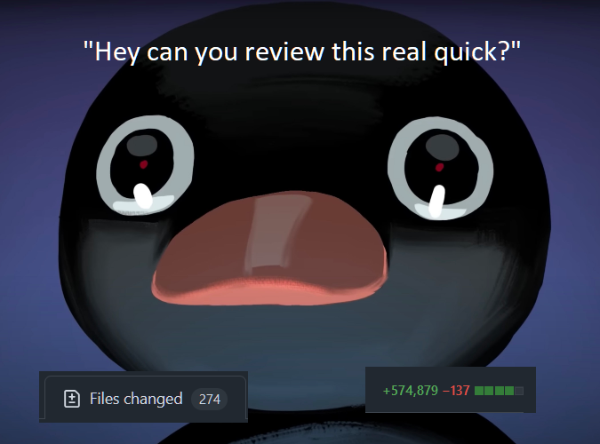

class: center, middle

# How to win friends and influcence devs
## 💝 By writing delightful PRs
## &nbsp;
### Loris Bognanni
#### October 2024

.bottom-notes[

]

---
## 1️⃣ Write small PRs
_If you take one thing away from this presentation, please let it be this one_ 😅 

### Small PRs are:

- ✏ Easier to write
- 👓 Easier to review
- ✅ Less risky
- 🎠 Give you a sense of momentum
- 🤫 _They also make you look better on your metrics!_

---
## 1️⃣ Write small PRs

### How small is small enough?

- Smaller than you think
- One PR per Shortcut ticket
- Does your ticket contain a checklist? Congrats, each item becomes a new ticket
- `:it-depends-patrick:`

---

## 1️⃣ Write small PRs

### Tops tips
 - 🚩 **Use feature flags**
    - pr `#1`: add feature flags
    - pr `#2..n`: add various bits
    - pr `#n+1`: remove feature flag
 - 📚 **Stack PRs**
    - pr `#1` targets `main`
    - pr `#2..n` targets `feature_branch`
    - You can review & merge all the subsequent PRs, and then finally merge the feature branch to main
    - ⚠ Careful with this, try not to have too many (>2) things open at once
 - 🗺 **Plan Carefully** ⭐
 
 - ⚔ **Got a big PR to review?** 

     `Can we split this into smaller PRs?` is a completely fair request

---

## 1️⃣ Write small PRs 

 

### 🤠 When to write large PRs 

- You're spiking something and pinky-swear to throw away the code when you're done
- You're doing some large automated refactoring that doesn't touch the logic (example, Use file scoped namespaces everywhere)

---

## 1️⃣ Write small PRs

 

### 😈 When (not) to write large PRs 

- CI takes forever? *Large PR* `*`
- Don't know what you're doing? *Large PR*
- Hate your reviewer? *Large PR*
- Want to look "busy" for days on end? *Large PR*
- Want to sneak in a security bug with noone noticing? *Huuge PR*

 
 
 
 
 

`*` _Ultimately, advocating for and implementing a faster / better pipeline is part of your job_
---
## 2️⃣ Make it easy  for the reviewer

Put yourself in the reviewer's shoes: what would make their day easier?

- 🧠 Reviewing PRs is hard work
- 🤯 Reading code is harder than writing it
- ⌛ You don't want to wait hours or days for a review
- 😐 "The reviewer" could well be future you!

    💭 Imagine: it's 2am and you're responding to an incident. You trace the bug to line 94 in `CalculationEngine.cs`. `git blame` says that PR `#3985` last touched that code. What would you like to see in that PR to help you get back to sleep ASAP?

#### You want to remove as much friction as possible from the review process!
    
---
## 2️⃣ Make it easy for the reviewer

### Top tips

- 🎨 **Use a sensible title** for your PR
    - On "squash & merge", this will become the commit text you'll `git blame`

- 📝 Add a PR description
    - **What** is this PR doing?
    - **Why** are we doing it this way?
    - What are the **risks**? What are we doing to **mitigate** them?
    - **Anything important** the reviewer should know?

- 🔖 Link to your Shortcut ticket
    - It gives the reviewer more context about what this is and where it sits in the overall epic/milestone/sprint

---
## 2️⃣ Make it easy for the reviewer

### Top tips / 2

- ♻ **Review your own PR**
    - Find bugs and protect your ego
    - Call out any important bits of logic
    - Preempt questions
    - Ask for feedback on specific lines

- 👩‍💻 Assign yourself
    - It makes it easier to find _your_ PR!
